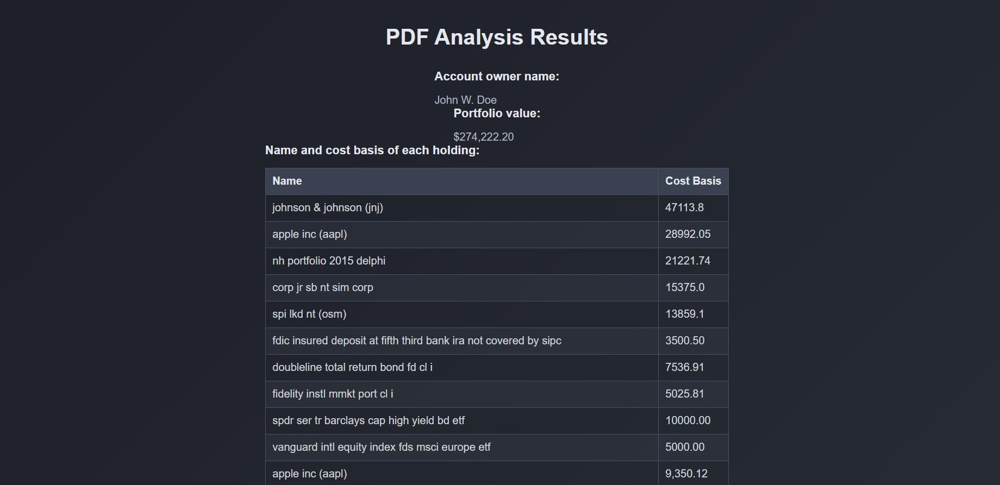

# Feathery Coding Assessment

The objective of this project is to develop a pipeline that efficiently extracts and analyzes information from PDF documents. The pipeline is designed to identify relevant content, convert it into a suitable format, and leverage OpenAI's capabilities for further analysis, all while minimizing unnecessary processing.

## Pipeline Steps

1. PDF Text Extraction:
Extract text from each page of the PDF to identify potential areas of interest.
2. Entity Detection:
Analyze the extracted text to detect specific entities such as "PERSON" and "MONEY". This step helps in filtering out irrelevant pages.
3. Relevance Filtering:
Determine the relevance of each page based on the presence of targeted entities. Only relevant pages are processed further.
4. PDF to Image Conversion:
Convert relevant pages into images, which are required for the subsequent analysis step.
5. OpenAI API Integration:
Use OpenAI's vision model to analyze the images. The model is guided by specific prompts to extract critical information, such as account owner names and portfolio values.
6. Result Compilation:
Compile the extracted information into a structured format for easy interpretation and display.
